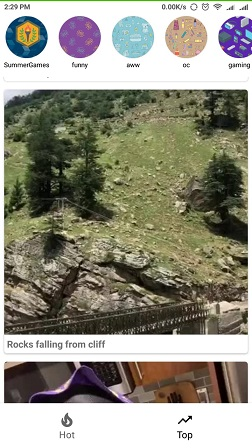

# Instaton-App(Instagram-Clone)

This is an Android Application which uses the imgur API for retrieving data like images and gifs and show it inside our app like in the official Instagram Application.

## Hot feed 

Shows the hot tag images inside the app  

## Top feed 

Shows the top tag images inside the app

## Story View

Shows the images in the form of stories like in Instagram app and also has the animation on top bar which when finishes the next story comes into the frame.

 

# Getting Started
You need to have Android Studio installed on your device and create an Android Virtual Device to run full Android OS and test the application.

## Installation
* Clone the repository in a directory of your choice
* Open the Instagram-Clone folder with Android Studio
* Add your API_KEY in the ImgurClient file
* Build the gradle file
* Now you can test the application on either android virtual device or your android device
